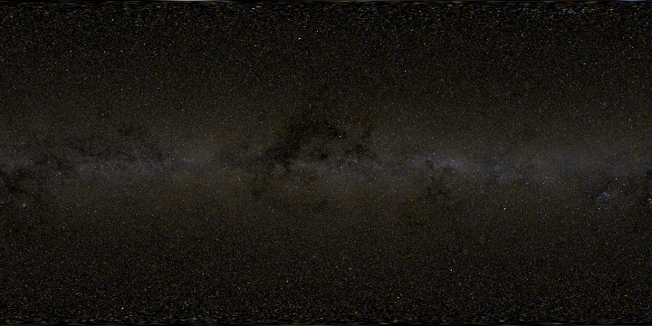
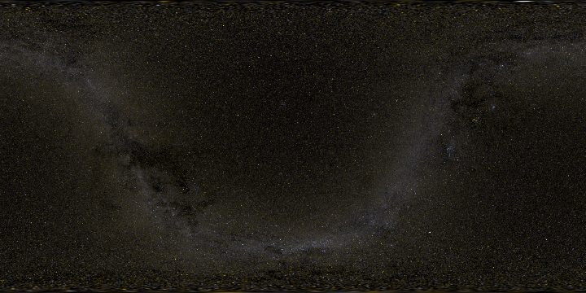
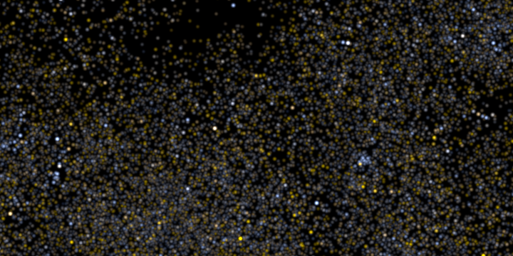

# Synthetic All-Sky Panorama

Copyright &copy; 2014 -- [Robert Kooima](http://kooima.net)

SYNASPAN is a short C program that synthesizes an all-sky panorama from Hipparcos and Tycho-2 stellar catalog data.

## Usage

    synaspan [-G] [-H dat] [-T dat] [-o tif] [-w w] [-h h] [-s s] [-m m] [-g g]
        -H NONE .......... Hipparcos catalog
        -T NONE .......... Tycho-2 catalog
        -o out.tif ....... output TIFF file name
        -w 4096 .......... output width
        -h 2048 .......... output height
        -s 1.0 ........... star shape standard deviation
        -m 6.0 ........... magnitude of 1-pixel star
        -g 1.0 ........... gamma correction
        -G ............... output in galactic coordinates

Stars are rendered as 2D Gaussian functions. The `-s` option gives the standard deviation and thus determines the size of each star. The `-m` option determines the overall brightness of the rendering by giving the stellar magnitude of a star that would be rendered with a "volume" of 1. Specifically, a star with magnitude `m` will be rendered as a 2D Gaussian function with standard deviation `s` and integral 1. All other stars will be scaled relative to this definition. Increase `s` to make the stars bigger and increase `m` to make them brighter.

The output is presented in equirectangular projection, with stars near the poles  distorted for correct reconstruction during reprojection. The equatorial coordinate system is used by default, and the `-g` option requests the galactic coordinate system instead. Output format is 32-bit floating point RGB TIFF.

## Input

The raw Hipparcos and Tycho-2 catalogs may be downloaded from the [Strasbourg Astronomical Data Center](http://cdsweb.u-strasbg.fr). The Hipparcos catalog resides in the gzipped file `hip_main.dat` [here (FTP)](ftp://cdsarc.u-strasbg.fr/pub/cats/I/239). The Tycho-2 catalog resides in the segmented gzipped file `tyc2.dat` [here (FTP)](ftp://cdsarc.u-strasbg.fr/pub/cats/I/259).

A star is rendered only if its record includes values for all of: right ascention, declination, visual magnitude, and blue magnitude. A Tycho star is rendered only if it does *not* already appear in the Hipparcos catalog. By these criteria, Hipparcos contributes 114,820 stars and Tycho contributes 2,311,831 stars. (The raw catalogs include 118,218 and 2,539,913 records, respectively.)

## Output

Here are outputs at a resolution of 16,384 &times; 8,192 in 16-bit RGB PNG:

-   [Equatorial coordinates (381MB)](https://drive.google.com/open?id=1MtyQVVHKa9MUztU9k8psSG6-kv5ruhiX)
-   [Galactic coordinates (427MB)](https://drive.google.com/open?id=1CVHo5Ux6RhdIxUiC_xYS9Gnz0htaWU7X)

The galactic coordinate image was generated by the following command line:

    ./synaspan -w 16384 -h 8192 -G -T tyc2.dat -H hip_main.dat -s 1 -m 8 -g 0.666

It was converted to 16-bit PNG using Imagemagick. Here's what it looks like, resized to 720 &times; 360 and saved as an 8-bit PNG.

Here is the same image in equatorial coordinates.

Finally, here is a crop of the center of the galactic image, showing pixels one-to-one.

