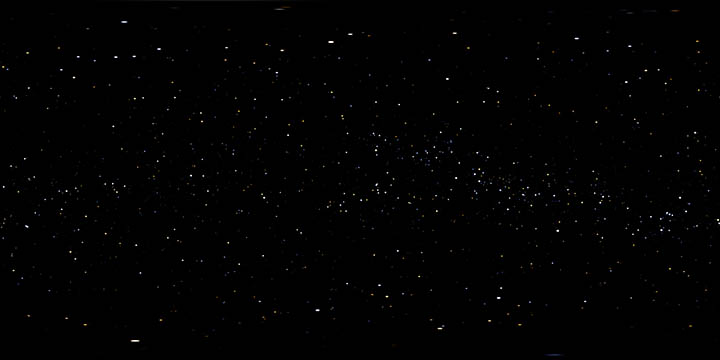
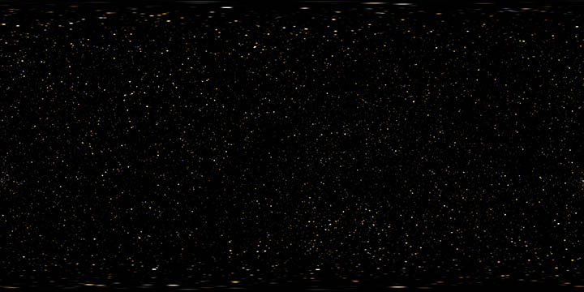
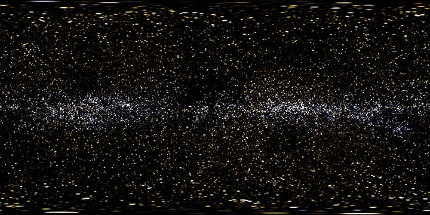

# xkcd mode

This is xkcd 1342, March 14, 2014.

It raises the question of how to distinguish large, distant stars and their old light from small, nearby stars and their new light. SYNASPAN can clarify this distinction.

Here's a map of the Hipparcos catalog rendered normally and saved with a gamma value of 4.0 to accentuate only the brightest stars.

	synaspan -w 2048 -h 1024 -G -H hip_main.dat -g 4 -o luminance.tif

[2048 &times; 1024 version](luminance.jpg)

The constellation Orion is clearly visible at the right and the Big Dipper appears at the upper left.

## The New

Now here's the Hipparcos catalog rendering in "xkcd mode" with the trigonometric parallax substituted into the magnitude. Parallax measures the angle through which a star appears to move against the background as the Earth moves across its orbit. Thus stars with high parallax are nearby. This rendering retains the coloration due to spectral type.

	synaspan -w 2048 -h 1024 -G -H hip_main.dat -x -g 4 -o proximity.tif

[2048 &times; 1024 version](proximity.jpg)

The result is a rendering of the sky based strictly on a star's proximity, not its size. Closer stars are bigger. This view of the night sky shows only the recently-emitted light. The characters of the comic would have nothing punchy to say about any of these stars. The apparent distribution of stars is quite uniform and the range of spectral types is representative of the population of the galaxy as a whole. Even among these stars, Sirius does not stand out.

## The Old

Here's the opposite. Magnitude is given by the reciprocol of the parallax, so brighter stars are farther away.

	synaspan -w 2048 -h 1024 -G -H hip_main.dat -X -g 4 -o distance.tif

[2048 &times; 1024 version](distance.jpg)

This is more interesting. There are more stars here because there are more far stars than close stars, duh. But we also see a concentration of hot, young, blue stars in the plane of the galaxy, with older, red stars elsewhere. These are the stars that could be long gone.

